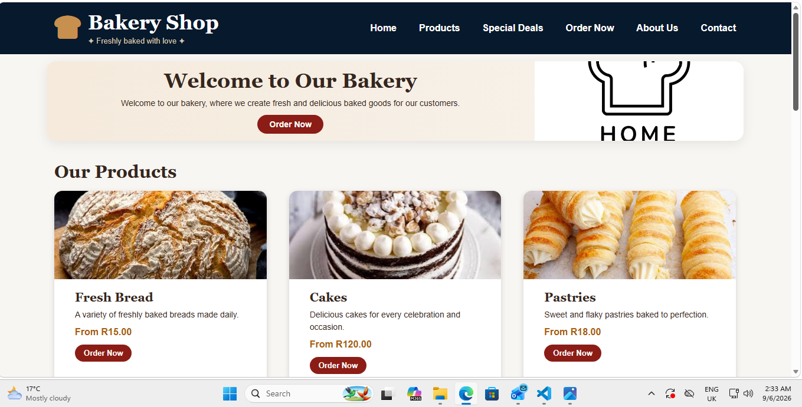
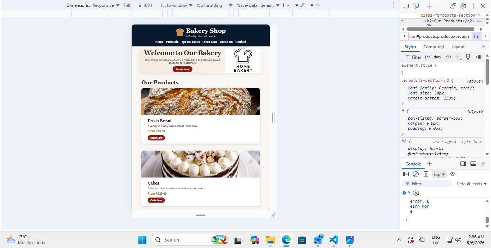
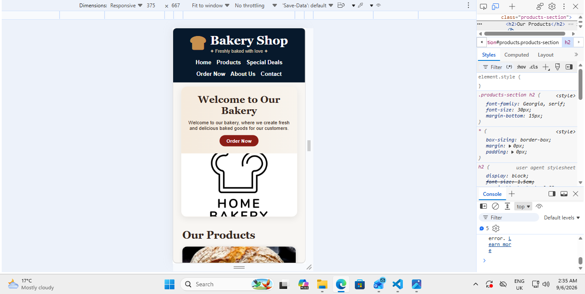

# Bakery Shop Website

## Project Description

This project is a responsive Bakery Shop website created using HTML and CSS.

The website was designed to provide customers with information about the bakery and the products available. Customers can view different bakery products, special deals, contact information, and use the Order Now buttons to place an order.

## Features

- Bakery Shop navigation menu
- Welcome section
- Product section
- Fresh Bread
- Cakes
- Pastries
- Product prices
- Order Now buttons
- Special Deals section
- Morning Special
- Cake Friday
- Bread Bundle
- Cupcake Special
- About Us section
- Contact information
- Opening hours
- Responsive design for different screen sizes

## Technologies Used

- HTML5
- CSS3
- GitHub

## Project Structure

Bakery-Shop-Part-2/
│
├── .git/
├── images/
├── screenshots/
├── index.html
├── README.md
└── style.css
## Responsive Design Testing

The website was tested on different screen sizes to ensure that the layout, navigation, typography, and images adapt correctly.

### Desktop View

### Tablet View

### Mobile View

## Changelog

### Part 2 - CSS Styling and Responsive Design

- Created and linked an external `style.css` stylesheet to the website.
- Applied consistent colours, typography, spacing, and visual styling across the website.
- Used CSS layout techniques to organise the website content.
- Added hover effects and other CSS pseudo-classes for interactive elements.
- Implemented responsive design using media queries.
- Adjusted the website layout for desktop, tablet, and mobile screen sizes.
- Adjusted typography, navigation, and images for smaller screens.
- Tested the website on desktop, tablet, and mobile screen sizes.
- Added responsive design testing screenshots to the README.md.
### Learning Resources

- W3Schools (n.d.) HTML and CSS Tutorials. Available at: https://eur03.safelinks.protection.outlook.com/?url=https%3A%2F%2Fwww.w3schools.com%2F&data=05%7C02%7Cst10473262%40rcconnect.edu.za%7C7cfc49fea74b4f78c8b808df0b8f1ba4%7Ce10c8f44f469448fbc0dd781288ff01b%7C0%7C0%7C639242381457186361%7CUnknown%7CTWFpbGZsb3d8eyJFbXB0eU1hcGkiOnRydWUsIlYiOiIwLjAuMDAwMCIsIlAiOiJXaW4zMiIsIkFOIjoiTWFpbCIsIldUIjoyfQ%3D%3D%7C0%7C%7C%7C&sdata=IpGjY0TMOapLOhks61hKUmQY5XWhNvuTBUmOMygDBdw%3D&reserved=0
- MDN Web Docs (n.d.) HTML and CSS Documentation. Available at: https://eur03.safelinks.protection.outlook.com/?url=https%3A%2F%2Fdeveloper.mozilla.org%2F&data=05%7C02%7Cst10473262%40rcconnect.edu.za%7C7cfc49fea74b4f78c8b808df0b8f1ba4%7Ce10c8f44f469448fbc0dd781288ff01b%7C0%7C0%7C639242381457219124%7CUnknown%7CTWFpbGZsb3d8eyJFbXB0eU1hcGkiOnRydWUsIlYiOiIwLjAuMDAwMCIsIlAiOiJXaW4zMiIsIkFOIjoiTWFpbCIsIldUIjoyfQ%3D%3D%7C0%7C%7C%7C&sdata=NVFQFM8Ei7hm50XkzRfHF0jfrrgMKLorQ8HKrMW8bXE%3D&reserved=0

W3Schools. (n.d.). HTML and CSS Tutorials. Available at: W3Schools⁠ [Accessed 5 September 2026].
MDN Web Docs. (n.d.). HTML and CSS Documentation. Available at: MDN Web Docs⁠ [Accessed 5 September 2026].
