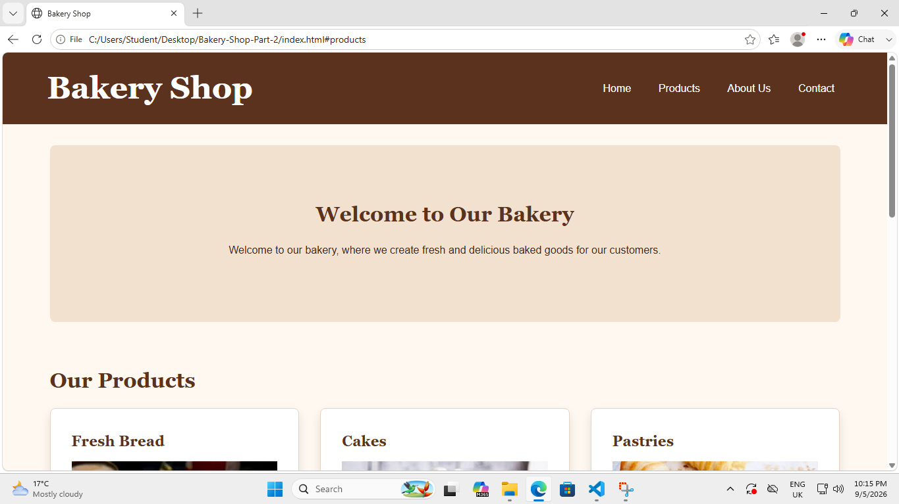
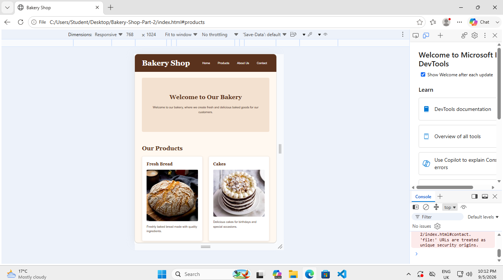
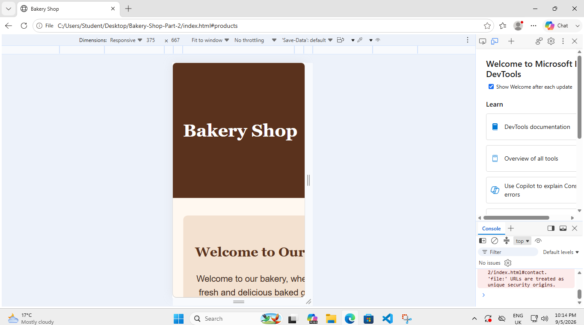

# Bakery Shop Website

## Project Description

This project is a Bakery Shop website created as part of a web development Portfolio of Evidence (PoE). The website provides information about the bakery and its products, including fresh bread, cakes and pastries.

The website was developed using HTML and CSS. Part 2 focused on improving the visual design of the website by applying CSS styling and creating a responsive design that adapts to desktop, tablet and mobile screen sizes.

## Technologies Used

- HTML5
- CSS3
- Visual Studio Code
- GitHub

## Part 2: CSS Styling and Responsive Design

For Part 2, an external CSS stylesheet was created and linked to the website.

The following improvements were implemented:

- A CSS reset was added for consistent styling.
- Base styles were applied to the website.
- Typography was styled using different font sizes, weights and line heights.
- Flexbox and CSS Grid were used to create the website layout.
- Colours, borders, border-radius and box shadows were added to improve the visual appearance.
- Pseudo-classes such as hover, focus and active were used for interactive elements.
- Media queries were implemented for tablet and mobile screen sizes.
- The layout adjusts from multiple columns on larger screens to fewer columns and a single-column layout on smaller screens.
- Typography and navigation were adjusted for different screen sizes.
- Images were made responsive.

## Responsive Design Testing

The website was tested at different screen sizes:

### Desktop

The desktop version displays the website using a multi-column layout.

### Tablet

The website was tested at approximately 768 × 1024 pixels. The layout adjusts to fit a tablet-sized screen.

### Mobile

The website was tested at approximately 375 × 667 pixels. The layout changes to provide a mobile-friendly single-column design.

## Changelog

### Part 2

- Created and implemented an external CSS stylesheet.
- Added a CSS reset using margin, padding and box-sizing properties.
- Added base styles for the website.
- Applied typography styling to headings, paragraphs and navigation elements.
- Created the desktop layout using Flexbox and CSS Grid.
- Added colours and decorative styling to improve the visual appearance.
- Added borders, border-radius and box-shadow effects to elements.
- Added hover, focus and active pseudo-classes for interactive elements.
- Added responsive media queries for tablet and mobile devices.
- Adjusted the layout for different screen sizes.
- Adjusted typography for smaller screens.
- Adjusted the navigation menu for smaller screens.
- Made images responsive.
- Tested the website using desktop, tablet and mobile screen sizes.

## Responsive Design Screenshots

### Desktop View

### Tablet View

### Mobile View

## References

### Images
The bakery images used in this project were obtained from the internet. The original sources could not be identified after further searching.

### Learning Resources

- W3Schools (n.d.) HTML and CSS Tutorials. Available at: https://eur03.safelinks.protection.outlook.com/?url=https%3A%2F%2Fwww.w3schools.com%2F&data=05%7C02%7Cst10473262%40rcconnect.edu.za%7C7cfc49fea74b4f78c8b808df0b8f1ba4%7Ce10c8f44f469448fbc0dd781288ff01b%7C0%7C0%7C639242381457186361%7CUnknown%7CTWFpbGZsb3d8eyJFbXB0eU1hcGkiOnRydWUsIlYiOiIwLjAuMDAwMCIsIlAiOiJXaW4zMiIsIkFOIjoiTWFpbCIsIldUIjoyfQ%3D%3D%7C0%7C%7C%7C&sdata=IpGjY0TMOapLOhks61hKUmQY5XWhNvuTBUmOMygDBdw%3D&reserved=0
- MDN Web Docs (n.d.) HTML and CSS Documentation. Available at: https://eur03.safelinks.protection.outlook.com/?url=https%3A%2F%2Fdeveloper.mozilla.org%2F&data=05%7C02%7Cst10473262%40rcconnect.edu.za%7C7cfc49fea74b4f78c8b808df0b8f1ba4%7Ce10c8f44f469448fbc0dd781288ff01b%7C0%7C0%7C639242381457219124%7CUnknown%7CTWFpbGZsb3d8eyJFbXB0eU1hcGkiOnRydWUsIlYiOiIwLjAuMDAwMCIsIlAiOiJXaW4zMiIsIkFOIjoiTWFpbCIsIldUIjoyfQ%3D%3D%7C0%7C%7C%7C&sdata=NVFQFM8Ei7hm50XkzRfHF0jfrrgMKLorQ8HKrMW8bXE%3D&reserved=0